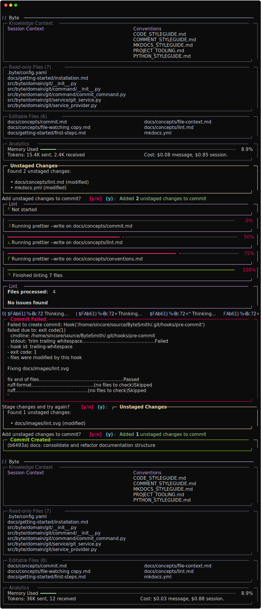

# Commit

Byte's commit system uses AI to generate meaningful commit messages by analyzing your staged changes. It automates the entire commit workflow - staging files, running linters, generating commit messages, and handling git operations.



---

## Quick Start

Create an commit:

```
> /commit
```

Byte will:

1. Stage all changed files (with confirmation)
2. Run configured linters on changed files
3. Analyze the git diff with AI
4. Generate a descriptive commit message
5. Create the commit with the generated message

If the commit fails (for example, when pre-commit hooks modify files), Byte will:

- Display the error message
- Prompt you to stage the changes and try again
- Re-stage all changes if you confirm
- Retry the commit with the same message

This is common with pre-commit hooks that automatically format or modify files - the hooks run, change the files, and cause the commit to fail because the staging area no longer matches the working directory.

## Configuration

### Linting Integration

Control linting behavior via `.byte/config.yaml`:

```yaml
lint:
  enable: true # Disable to skip linting during commits
  commands:
    - command: "ruff format"
      extensions: [".py"]
```

See [Linting concept](lint.md) for detailed configuration.

---

## Commit Message Format

The AI generates messages following conventional commit conventions:

### Structure

```
<type>(<scope>): <subject>

<body>

<footer>
```

### Types

Common commit types the AI uses:

- **feat** - New feature
- **fix** - Bug fix
- **docs** - Documentation changes
- **style** - Code style changes (formatting, whitespace)
- **refactor** - Code restructuring without behavior change
- **perf** - Performance improvements
- **test** - Test additions or modifications
- **chore** - Build process, tooling, dependencies

### Examples

**Simple feature:**

```
feat: add password reset functionality
```

**Bug fix with scope:**

```
fix(auth): prevent token expiration race condition
```

**Breaking change:**

```
feat!: redesign authentication API

BREAKING CHANGE: AuthService.login() now returns a Promise
instead of synchronous result. Update all callers to use await.
```

---
