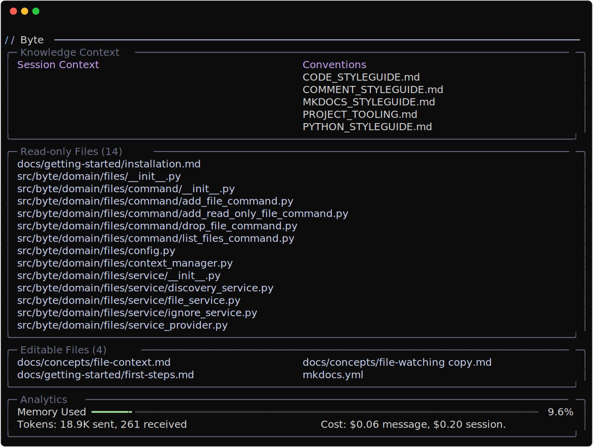

# Conventions

Conventions are Markdown files stored in `.byte/conventions/` that describe how code should be written in your project. The AI automatically receives these conventions before generating any code, ensuring consistency across all suggestions and modifications.



---

## Creating Conventions

### Convention Files

Store convention documents as Markdown files in `.byte/conventions/`:

### File Format

Conventions use standard Markdown formatting:

```markdown
# Python Style Guide

## General Rules

- Use snake_case for functions and variables
- Use PascalCase for class names
- Maximum line length: 88 characters

## Documentation

All public functions require docstrings with usage examples.
```

---

## How Conventions Work

### Automatic Loading

When Byte starts, it:

1. Scans `.byte/conventions/` for all `.md` files
2. Loads each file's content
3. Formats them with metadata (filename and source path)
4. Stores them in memory for quick access

### Injection into Prompts

Before each AI interaction, Byte injects all conventions into the prompt:

```
# Coding and Project Conventions
**Important:** Adhere to the following project-specific conventions.

---
title: Python_Style.md
source: .byte/conventions/python_style.md
---

[convention content]

---
title: Api_Design.md
source: .byte/conventions/api_design.md
---

[convention content]
```

This ensures the AI always has context about your project's standards.

---

## Best Practices

### Be Specific

Provide concrete examples rather than abstract rules:

**Less effective:**

```markdown
Use good naming conventions.
```

**More effective:**

```markdown
Use descriptive names:

- `user_repository` not `ur`
- `calculate_total_price()` not `calc()`
```

### Show Code Examples

Include actual code snippets demonstrating the pattern:

```markdown
## Error Handling

Catch specific exceptions:

\`\`\`python
try:
result = await process_file(path)
except FileNotFoundError:
logger.error(f"File not found: {path}")
return None
\`\`\`
```

### Keep It Current

Update conventions as your project evolves. Remove outdated rules and add new patterns as you discover them.

### Organize by Topic

Create separate files for different aspects:

- `PYTHON_STYLE.MD` - Language-specific formatting
- `ARCHITECTURE.MD` - System design patterns
- `API_DESIGN.MD` - API conventions
- `TESTING.MD` - Test organization and patterns
