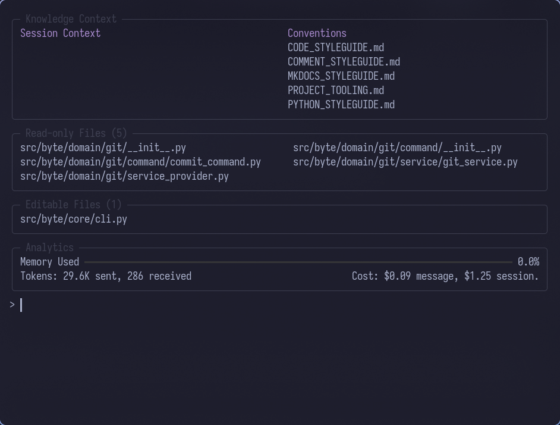

# File Context

The file context acts as the AI's "workspace" - only files added to the context are visible to the AI. This design gives you precise control over what the AI can access and change, preventing unwanted modifications and reducing noise in the AI's decision-making.



---

## File Modes

Byte supports two access modes for files in context:

### Read-Only Mode

Files added as read-only are visible to the AI for reference but cannot be modified. The main use case is to add files you want the AI to be aware of but not change.

**Command:** `/read-only <file_path>`

```
> /read-only config.yaml
Added config.yaml (read-only)
```

### Editable Mode

Files added as editable can be modified by the AI through SEARCH/REPLACE blocks.

**Command:** `/add <file_path>`

```
> /add src/main.py
Added src/main.py (editable)
```

---

## Adding Files

### Single Files

Add individual files by specifying their path relative to the project root:

```
> /add src/services/auth.py
> /read-only README.md
```

### Multiple Files with Wildcards

Use glob patterns to add multiple files at once:

```
> /add src/models/*.py
Added src/models/user.py (editable)
Added src/models/post.py (editable)
Added src/models/comment.py (editable)
```

**Supported patterns:**

- `*` - matches any characters in a filename
- `**` - matches directories recursively
- `?` - matches a single character
- `[seq]` - matches any character in seq

**Examples:**

```
> /add tests/**/*.py           # All Python test files
> /add src/domain/*/config.py  # All config.py in domain subdirectories
> /read-only docs/*.md          # All Markdown files in docs
```

---

## Viewing Context

### List All Files

See all files currently in context:

```
> /ls
```

This displays two panels:

- **Read-Only Files** - Files available for reference
- **Editable Files** - Files the AI can modify

### Before Each Prompt

Byte automatically displays the current context before accepting your input, so you always know what files the AI can access.

---

## Removing Files

### Single Files

Remove a file from context when it's no longer needed:

```
> /drop old_file.py
Removed old_file.py from context
```

### Multiple Files with Wildcards

Remove multiple files using patterns:

```
> /drop tests/**/*.py
```

This removes all Python test files from the context.

---

## File Discovery

Byte automatically discovers all files in your project on startup, respecting `.gitignore` patterns. This enables:

- **Tab completion** - Press Tab while typing file paths to see suggestions
- **Fast lookups** - File operations use a cached index for performance
- **Automatic filtering** - Git-ignored files are excluded from suggestions

The discovery service:

1. Scans your project directory recursively
2. Loads `.gitignore` patterns and configuration ignore rules
3. Builds an in-memory index of available files
4. Updates the index when files change (if file watching is enabled)

### Ignore Patterns

Files are automatically excluded based on:

1. **`.gitignore` rules** - Standard git ignore patterns from your project's `.gitignore` file
2. **Configuration patterns** - Custom ignore rules defined in `.byte/config.yaml`

You can add additional ignore patterns in your `.byte/config.yaml`:

```yaml
files:
  ignore:
    - .byte/cache
    - .ruff_cache
    - "*.log"
    - build/
```

These patterns use gitignore-style syntax and are combined with your `.gitignore` rules. Patterns support:

- `*` - Wildcard for any characters
- `**` - Matches directories recursively
- `?` - Single character match
- Negation with `!` prefix
- Directory-specific patterns with trailing `/`

See the [Settings Reference](../reference/settings.md) for complete configuration options.

---

## Best Practices

### Start Small

Begin with only the files directly related to your task:

```
> /add src/main.py
> /read-only config.yaml
```

Add more files as needed rather than loading everything upfront.

### Use Read-Only Strategically

Add reference files as read-only to provide context without risking unwanted changes:

```
> /read-only docs/architecture.md
> /read-only .env.example
```

---

## Context in AI Prompts

When the AI receives your message, Byte includes a structured context block with all files:

```
# Here are the files in the current context:

## READ-ONLY FILES (for reference only):
---
source: config.yaml
mode: read-only
---
[file contents]

## EDITABLE FILES (can be modified):
---
source: src/main.py
mode: editable
---
[file contents]
```

This format helps the AI understand:

- What files are available
- What permissions it has for each file
- The current state of each file

---

## Related Concepts

- [File Watching](file-watching.md) - Automatic context updates when files change
- [Conventions](conventions.md) - Project-specific guidelines automatically included in context
- [Settings Reference](../reference/settings.md) - Configuration options for file handling
