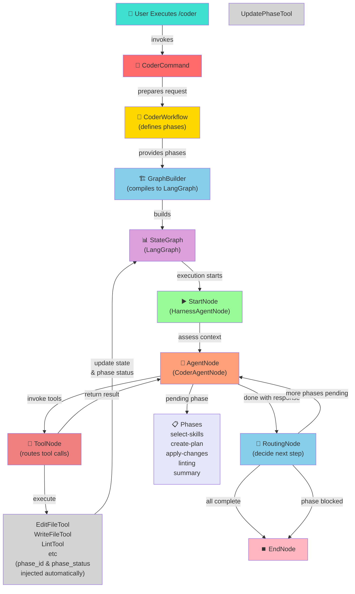

# Architecture Overview

**Category**: Explanation

Byte's architecture is built around a command-driven workflow engine that coordinates multiple agents, phases, and tools into a cohesive system. This page explains how the pieces fit together and why this design enables safe, controllable AI-assisted development.

## Core Concept: Commands Drive Workflows

When you execute a slash command (e.g., `/coder`), you're invoking a `Command`. Commands are lightweight entry points that wire up a workflow and delegate execution to it. The workflow orchestrates everything that follows.

```
User runs /coder "implement feature X"
    ↓
CoderCommand.execute()
    ↓
CoderWorkflow (manages phases and state)
    ↓
Agent Graph (LangGraph StateGraph)
```

This separation of concerns means commands remain simple and focused—they don't contain business logic themselves. They simply prepare the request and hand it off to the workflow engine.

## Workflows: Multi-Phase Orchestration

A workflow defines a sequence of **phases** that must be completed in order. Each phase has:

- A **description** of what needs to happen
- A list of **tools** available to complete it
- An **Agent Node** that executes the phase
- A **status** (pending, in_progress, completed, or blocked)

Phases are not arbitrary steps—they represent distinct stages of work. For example, the `CoderWorkflow` defines:

1. **select-skills-and-files** — Prepare the context and instruction
2. **create-plan** — Design the implementation
3. **apply-changes** — Write the code
4. **linting** — Validate and fix lint errors
5. **summary** — Recap what was done

An agent works through phases sequentially. The workflow tracks phase progress automatically—every tool call in a phase receives `phase_id` and `phase_status` arguments injected by the orchestration layer, enabling any tool to report phase completion. The agent simply calls tools to make progress; phase status flows through every tool invocation.

## Agent Nodes: The Workers

An **Agent Node** is a LangGraph node that runs an LLM-powered agent. It receives the workflow state, looks at the current pending phase, and uses available tools to make progress. Key characteristics:

- **One LLM invocation per agent** — The node prompts the agent and waits for a response
- **Tool-driven** — The agent doesn't compute; it calls tools (file edits, linting, etc.)
- **Phase-aware** — The agent sees which phase is pending and focuses only on that
- **Stateless loop** — The node can be called repeatedly; state is managed by the workflow

Different Agent Nodes can specialize in different tasks. `CoderAgentNode` is optimized for code generation; other domains might have specialized agents for their own workflows.

## Tools: The Hands of the Agent

Tools are the **concrete operations** that agents invoke. They fall into two categories:

### Workflow Tools

- `CreatePlanTool` — Plan out the implementation steps
- `CompleteTurnTool` — Finish the workflow with a summary

### Domain-Specific Tools

- `EditFileTool`, `WriteFileTool`, `DeleteFileTool` — Modify files
- `LintTool` — Validate code
- `UserInputTool`, `UserSelectTool` — Ask the user for input

Tools have strict input schemas (JSON Schema), so the agent's requests are validated before execution. Tool results feed back into the agent's next message, creating a feedback loop.

## The Graph: LangGraph StateGraph

Under the hood, workflows are compiled into a **LangGraph StateGraph**—a directed graph of nodes and edges that orchestrates execution. The `GraphBuilder` creates this graph:

```
START
  ↓
start_node (HarnessAgentNode)
  ↓
coder_agent_node (CoderAgentNode)
  ↓
tool_node (ToolNode — routes tool calls)
  ↓
routing_node (RoutingNode — determines next step)
  ↓
END
```

**Why this structure?**

- **Separation of concerns** — Tool invocation is handled by `ToolNode`, not the agent
- **Controllable loops** — The routing node decides whether to loop back to the agent or move forward
- **Persistent state** — LangGraph's checkpointer saves state after every step, enabling resumable workflows
- **Streaming** — Events flow through the graph and surface in the TUI in real time

## State: Single Source of Truth

The `BaseState` TypedDict holds everything:

- **workflow_phases** — All phases and their current statuses
- **harness** — Skills, editable files, and instruction for the agent
- **history_messages** — Persistent conversation history
- **scratch_messages** — Ephemeral validation or error messages
- **touched_files** — Files modified during this workflow
- **user_request** — The original request that kicked off the workflow
- **metadata** — Analytics and tracking info

When a tool executes (e.g., a file edit), it updates the relevant part of state. The next agent invocation sees the updated state, so it knows what changed.

## Routing: Deciding What Comes Next

The `RoutingNode` looks at the workflow state after each agent response:

1. **If phases remain pending** → Loop back to the agent node
2. **If all phases are completed** → Move to the end node and finish
3. **If a phase is blocked** → Optionally allow user intervention or fail gracefully

This routing logic keeps workflows moving forward without hardcoded branching logic.

## Why This Architecture?

**Safety through control** — Agents don't autonomously loop forever. Phases provide explicit boundaries, and the user always has visibility into what's happening.

**Reusability** — New workflows inherit the same graph structure, phase model, and state management. You define phases and tools; the engine handles orchestration.

**Observability** — Every step (agent invocation, tool call, phase update) is a node in the graph. The TUI streams events in real time, and the checkpointer logs every state change.

**Extensibility** — New domains add custom agent nodes and tools without touching the core graph. Tools and phases compose cleanly because they all speak the same StateGraph language.

## Architecture Diagram



## Key Takeaways

1. **Commands are entry points** — they hand off to workflows, not business logic containers
2. **Workflows define phases** — a sequence of distinct, bounded work units
3. **Agents are phase executors** — they see one pending phase and use available tools
4. **Tools are the operations** — agents call tools; tools update state
5. **RoutingNode drives flow** — it decides whether to loop, advance, or finish
6. **StateGraph is the engine** — LangGraph orchestrates all of this persistently and observably

This design prioritizes **clarity, control, and composability** over speed or autonomy. Every workflow is understandable, observable, and can be extended without modifying core infrastructure.
