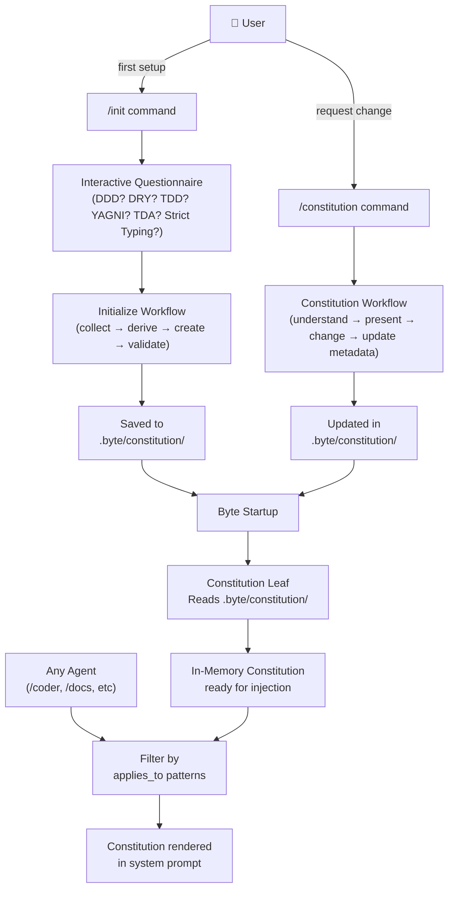

# The Constitution

**Category**: Explanation

Byte's constitution is a structured governance document that enforces project-wide standards on every AI agent. It's not a legal document—it's a technical contract that lives in your codebase, gets version-controlled, and shapes how every agent thinks and makes decisions.

When you run `/init`, Byte creates a constitution tailored to your project. That constitution is then injected into the system prompt of every agent, ensuring consistent behavior across all AI-assisted development work.

## What the Constitution Is

The constitution is a living document composed of three parts:

**Core Principles** — Non-negotiable rules your project follows. Examples: Domain-Driven Design, Don't Repeat Yourself (DRY), Test-Driven Development (TDD), strict typing, or custom practices you define. Each principle has an order number, a clear name, and explicit description of what it means.

**Sections** — Topic-specific guidance that can be scoped to specific file paths. For example, a "Security Requirements" section could apply only to `src/byte/auth/**`. Sections contain named items (like "Secret Management" or "API Key Rotation"), each with full content. A section without `applies_to` patterns is global and appears in every agent's prompt.

**Governance Rules** — Meta-level rules about the constitution itself. Examples: "Supremacy" (this constitution overrides all other practices), "Versioning Policy" (how to version the constitution using semver), "Amendment Process" (how changes are approved). These are always global.

**Metadata** — Version (following semver), ratification date (when it was created), and last amended date (when it was last changed).

## How It's Structured

The constitution lives on disk as a directory of markdown files at `.byte/constitution/`:

```
.byte/constitution/
├── constitution.md              # YAML frontmatter: version, ratified, last_amended
├── principles/
│   ├── ddd.md                   # YAML frontmatter: id, name, order
│   ├── dry.md
│   └── strict-typing.md
├── governance/
│   ├── supremacy.md             # YAML frontmatter: id, name, order
│   └── versioning-policy.md
└── sections/
    ├── tooling-framework-standards/
    │   ├── section.md           # YAML frontmatter: id, name, applies_to (optional), order
    │   └── items/
    │       ├── framework-standards.md      # YAML frontmatter: id, section_id, name, order
    │       └── linting-formatting.md
    └── security-requirements/
        ├── section.md
        └── items/
            ├── secret-management.md
            └── api-key-rotation.md
```

Each file uses YAML frontmatter for metadata and markdown body for content. No JSON, no single-file serialization—everything is human-readable and diff-friendly.

## How It's Initialized

Run `/init` to launch an interactive questionnaire:

```bash
/init
```

Byte asks you about core practices: Do you want Domain-Driven Design? DRY? TDD? YAGNI? Tell, Don't Ask? Strict Typing? Tooling preferences? Your answers seed an initial constitution draft.

Behind the scenes, the Initialize Workflow:

1. **Collects requirements** — Interviews you about project values and governance needs; examines your repo for existing standards
2. **Derives values** — Infers concrete values from conversation history and existing docs; generates version numbers and dates
3. **Creates the constitution** — Uses targeted tools to add principles, sections, governance rules, and metadata one by one
4. **Validates** — Ensures no placeholder tokens remain and all sections are properly scoped

The finished constitution is saved to `.byte/constitution/` and immediately becomes active.

## How It Reaches Agents

Every time you run a command, Byte loads the constitution and injects it into the agent's system prompt. This happens via the **Constitution Leaf** in the prompt assembly pipeline.

The Constitution Leaf:

1. Reads the constitution directory from disk
2. Renders it as formatted markdown
3. (Optionally) **filters sections** — If the agent is working on specific files, only sections whose `applies_to` globs match those files are included. Global sections (no `applies_to`) always appear.
4. Inserts the markdown into the system prompt

The agent sees the full constitution context before it starts working. It reads the principles, understands the governance rules, and respects any scoped sections relevant to the files being edited.

## How to Modify It

Request constitution changes with `/constitution`:

```bash
/constitution Add a new principle about error handling
/constitution Remove the TDD principle
/constitution Update the versioning policy to use calendar versioning
```

The Constitution Workflow:

1. **Understands your request** — Harness Agent analyzes your instruction and conversation history
2. **Presents the current constitution** — You see what exists; clarifications are made if needed
3. **Makes surgical changes** — The Constitution Agent uses targeted operations: add a principle, delete a section, update a governance rule, etc. Only what you asked for changes; everything else stays the same.
4. **Updates metadata** — If principles or sections change materially, the "last amended date" and potentially the version are updated.

Changes are written back to `.byte/constitution/` immediately and are active on the next agent invocation.

## Section Scoping with File Patterns

Sections can be scoped to specific files using glob patterns in the `applies_to` field:

```yaml
---
id: security-requirements
name: Security Requirements
applies_to:
  - "src/byte/auth/**"
  - "src/byte/api/**"
order: 1
---
```

When an agent works on `src/byte/auth/login.py`, this section appears in its prompt. When it works on `src/byte/models/user.py`, it doesn't. Global sections (no `applies_to`) always appear.

This lets you enforce different standards for different domains without cluttering the constitution with irrelevant rules.

## Versioning

The constitution version follows semantic versioning:

- **MAJOR** — Backward-incompatible changes: removing a principle, redefining governance rules, or fundamentally altering existing guidance
- **MINOR** — Adding new principles, adding new sections, or materially expanding existing guidance
- **PATCH** — Wording clarifications, typo fixes, reorganization, or other non-semantic refinements

When you request changes via `/constitution`, the Constitution Agent proposes a version bump. You can accept it or override it.

## The Constitution Flow



## Key Takeaways

1. **The constitution is your AI coding standard** — It's the single source of truth for what agents should do and how they should behave
2. **It's version-controlled** — Lives in `.byte/constitution/` as readable markdown, not a binary blob
3. **It's injected, not hard-coded** — Changes take effect on the next agent run; no recompilation or restart needed
4. **It's scoped** — Sections can target specific file patterns, letting you enforce different rules for different domains
5. **It's versioned semantically** — MAJOR/MINOR/PATCH changes are tracked and documented
6. **It's changeable** — Use `/constitution` to request modifications; the Constitution Agent makes surgical edits

The constitution is how you define your project's values and enforce them on every piece of AI-assisted work.
