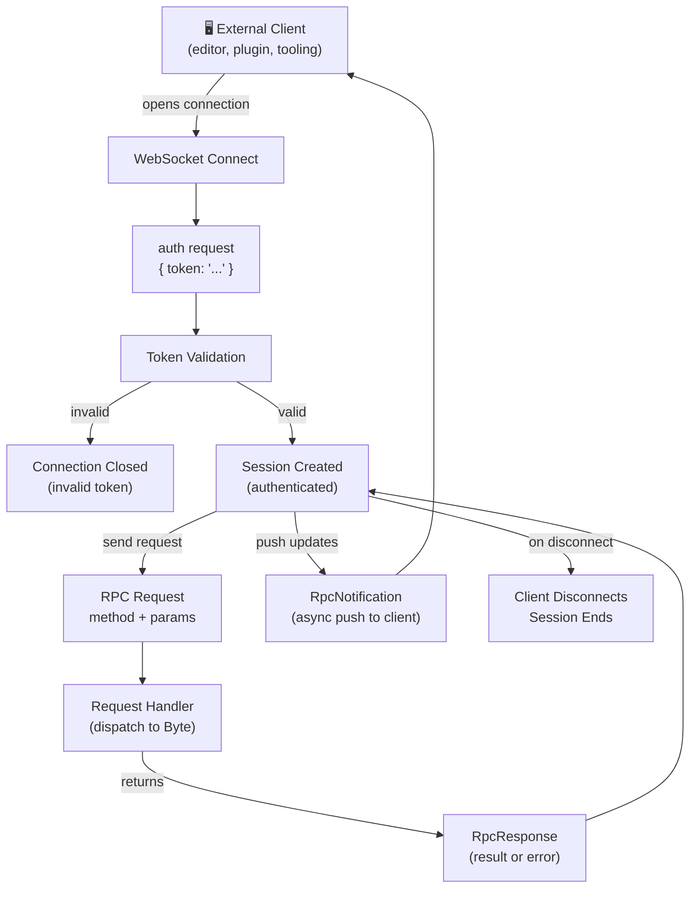

# The Gateway

**Category**: Explanation

Byte's gateway is a WebSocket JSON-RPC 2.0 server that exposes an authenticated RPC interface for external clients. Editors, IDE plugins, and custom tooling connect to the gateway and invoke Byte remotely—adding files to context, configuring models, receiving streaming responses in real time. The gateway owns the full connection lifecycle: auth handshake, session management, request dispatch, and asynchronous notifications back to the client.

## What Is the Gateway?

The gateway is not a REST API or a CLI wrapper. It's a persistent, stateful WebSocket server that maintains a single authenticated session per client connection. Connect, authenticate, then issue RPC requests and receive streaming notifications for as long as the session is alive.

The design is deliberate: one session per connection keeps client-side state in sync with Byte's internal state. No polling, no request batching ambiguity, no stateless HTTP overhead. Messages flow bidirectionally in real time.

## How It Works

### Auth Handshake

The first message on any new WebSocket connection **must** be an `auth` request with a valid token:

```json
{
  "jsonrpc": "2.0",
  "id": "1",
  "method": "auth",
  "params": { "token": "..." }
}
```

The token is generated when the gateway starts and written to `.byte/cache/gateway.token` with `0o600` permissions—readable only by the user running Byte. External clients read that file to authenticate. An invalid token closes the connection immediately. A valid token opens the session.

### Session Lifecycle

Once authenticated, a session is created for the connection. It processes inbound RPC requests, routes them to handlers, and returns `RpcResponse` objects (success or error). It also receives events from other parts of Byte and pushes `RpcNotification` objects to the client asynchronously.

The session lives until the client disconnects or an error occurs. State is tied to the connection—one session, one client, one coherent view of Byte's state.

### Streaming Notifications

RPC requests get a single `RpcResponse` back—synchronous, one-to-one. Notifications are different: they flow asynchronously from server to client only. When Byte has updates to push—streamed response chunks, tool execution results, status changes—it sends `RpcNotification` objects without waiting for a request. Your client receives these interleaved with response completions, enabling real-time updates throughout the session.

## The Protocol

The gateway speaks JSON-RPC 2.0. Every message is a JSON object with `"jsonrpc": "2.0"`.

### RpcRequest

Inbound requests from the client. Required fields: `jsonrpc`, `id`, `method`. Optional: `params`.

```json
{
  "jsonrpc": "2.0",
  "id": "request-123",
  "method": "add_file",
  "params": { "file_path": "src/main.py" }
}
```

### RpcResponse

The final result for a request. Contains either `result` (success) or `error` (failure)—never both.

```json
{
  "jsonrpc": "2.0",
  "id": "request-123",
  "result": { "ok": true, "file_path": "src/main.py" }
}
```

### RpcNotification

Outbound streaming events with no request id. Sent asynchronously by the server.

```json
{
  "jsonrpc": "2.0",
  "method": "stream/response",
  "params": { "content": "The answer is...", "done": false }
}
```

### RpcError

Embedded in error responses. Contains `code` (integer), `message` (string), and optional `data`.

```json
{
  "code": -32000,
  "message": "Unauthorized",
  "data": null
}
```

Standard JSON-RPC error codes apply: `-32700` (Parse Error), `-32600` (Invalid Request), `-32601` (Method Not Found). Custom codes: `-32000` (Unauthorized), `-32001` (Internal Error).

## Connection Flow



## Configuration

Enable and configure the gateway in `.byte/config.jsonc`:

```jsonc
{
  "gateway": {
    "enable": true,
    "host": "127.0.0.1",
    "port": 0,
  },
}
```

- `enable` — Whether the gateway server starts at boot. Defaults to `false`.
- `host` — The hostname to bind to. Defaults to `"127.0.0.1"` (localhost only).
- `port` — The port to bind to. Defaults to `0` (OS assigns an available port). Set a fixed port if your client needs a stable address—you own managing port conflicts.

When the gateway starts, it writes a discovery file to `.byte/cache/gateway.json` with the actual host, port, and token file path. External clients read this file to locate the server.

## Security

The gateway is built for local development and scoped accordingly.

**Token authentication** is the primary control. The token is generated with `secrets.token_urlsafe(32)`—cryptographically strong—and written to disk with `0o600` permissions. Only the user who started Byte can read it.

**Discovery file** (`.byte/cache/gateway.json`) tells clients where the server is running and where to find the token. It's regenerated on every startup.

**Localhost by default.** The gateway binds to `127.0.0.1`, rejecting all remote connections. Built for developers who want a secure local interface without network exposure. If you expose the gateway to a network, the token becomes your only protection—layer additional auth (mutual TLS, API keys, OAuth) on top for distributed scenarios.

## Available Requests



## Key Takeaways

1. **The gateway is a persistent WebSocket server** — not a REST API; the connection stays open for the lifetime of the session
2. **Authentication is mandatory** — every connection must send an `auth` request as its first message; invalid tokens are rejected immediately
3. **One session per connection** — state is tied to the connection, keeping client and server in sync without polling
4. **Requests are synchronous, notifications are async** — RPC requests get a single response; notifications flow from server to client whenever Byte has updates to push
5. **JSON-RPC 2.0 is the protocol** — standard error codes, structured messages, and bidirectional communication
6. **Localhost by default** — the gateway binds to `127.0.0.1`; exposing it to a network requires you to add additional auth on top
7. **Discovery is file-based** — `.byte/cache/gateway.json` tells clients where to connect; `.byte/cache/gateway.token` holds the auth token
