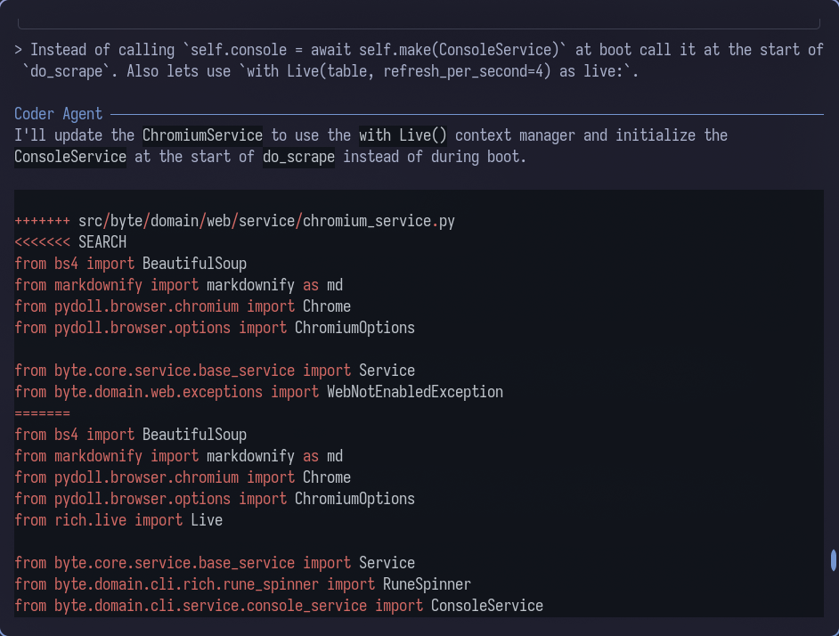

# Example Flow

Foo

---

Byte works best when your project uses DDD (Domain Driven Design) for both the frontend and the backend. Becuase you can feed an entire domain in to the read only context it makes it easy to give
byte a template that it should follow.

In this example we will add a progress display to the web command. I will be doing this entire workflow from the CLI however it can be done just as easily using watch and AI commands (Link to AI commands)

## Step 1

First we need to add the files that byte will be working on in to the editable context. In this context I knopw that the web command resides in our web domain so I will add the whole web domain for editing.

```
/add src/byte/domain/web/**
```


As you can see all the files in my web domain are now in the editable context.

## Step 2

Now we need to add our refrence files. This can be an entire domain or only a few files. The key here is to add them to the read only context.

In this case I know that the rune spinner is used only in one file so we will add the actual componennt and its implmentation in to the read only context.

```
/read-only src/byte/domain/cli/rich/rune_spinner.py
/read-only src/byte/domain/cli/service/stream_rendering_service.py
```


Now we have the files we want to edit and the files read only refrence files in context.

## Step 3

Technically at this point we could ask the agent to complete the change. However our web scrapping implmentation uses `pydoll` so its a good idea in my opion to feed dome of the documentation in to our context as well. For this we will use the `/web` command. (Yep same command as we are working on here.)

```
/web https://pydoll.tech/docs/
```


Once scraped byte will ask you if you would like to add the content as is, clean it up using the weak model, or cancel. Its usually a good practice to clean up the scraped content but since this feature is small we will keep it as is.


Now that we have all of peices tougether we can ask Byte to make the change.

## Step 4

Asking byte to make the request can be done in 2 diffrent ways. You can either

A: first use the `/ask` command to see how byte recomends making this change. Becuase `ask` dosent have any tools or the ability to change files this is a good way to first discuss the change before byte implments it. This is possible becuase memory is shard betwean main agents.

B: dont use any command and ask byte to make the change. This is a bit more of a YOLO move but you can always press `CTRL + C` to cancel the generation mid prompt.

For this tutorial we are going to go with method A.

```
/ask How would you suggest we implment a rich Live using our Rune spinner while we are scrapping web content in our ChromiumService
```


Now what was recomended was close but not perfect. Depending how close the response is you may want to followup with anouther `/ask` but in this case we will course correct while asking to implment.

```
Instead of calling `self.console = await self.make(ConsoleService)` at boot call it at the start of `do_scrape`. Also lets use `with Live(table, refresh_per_second=4) as live:`
```


Here you can see byte using search replace blocks so you can see the change as it's happening.

Once the change is applied if you have lint commands enabled byte will try to run those commands aginest the chanegd files:


## Step 5

Thats it! what we asked for has been implmented. We can now choose to keep asking for changes in the same manor or you can use the `/clear` command to clear just the chat history or `/reset` command to clear history and context.

Remember to keep an eye on how much memory has been used.

