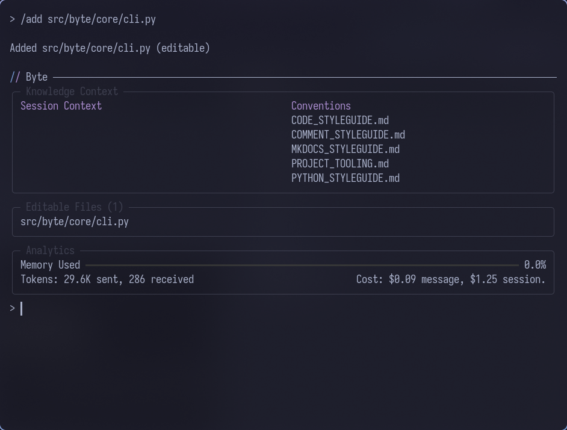

# First Steps

Configure Byte and run your first session.

---

## Prerequisites

Before running Byte:

- **Git repository** - Byte operates inside a git repository
- **Good terminal** - A modern terminal emulator with proper rendering support (like Kitty, Foot, WezTerm, or Alacritty)
- **API key** - One of these environment variables must be set:
  - `ANTHROPIC_API_KEY` for Claude models
  - `GEMINI_API_KEY` for Google Gemini
  - `OPENAI_API_KEY` for OpenAI models

---

## Configuration

### Set Your API Key

Export the environment variable for your chosen provider:

```bash
$ export ANTHROPIC_API_KEY=your-key-here
```

Or create a `.env` file in your project root:

```bash
$ echo "ANTHROPIC_API_KEY=your-key-here" > .env
```

### Navigate to Your Project

Byte runs from within a git repository:

```bash
$ cd /path/to/your/project
$ git init  # If not already a git repo
```

---

## Running Byte

Launch Byte from your project directory:

```bash
$ byte
```

On first run, Byte's `FirstBootService` will guide you through initial setup:

1. **Choose LLM Provider** - Select your preferred AI provider (Anthropic, Gemini, or OpenAI)
2. **Configure Web Commands** - Automatically detects Chrome/Chromium for web scraping
3. **Enable File Watching** - Optionally enable automatic detection of AI comment markers
4. **Setup .gitignore** - Adds `.byte/cache` and `.byte/session_context` patterns

The service creates:

- `.byte/` directory in your project root
- `config.yaml` with your selected configuration
- `conventions/` directory for project-specific coding standards
- `context/` directory for session context
- `cache/` directory for temporary files

---

## The .byte Directory

Byte creates a `.byte/` directory containing:

- **config.yaml** - Configuration settings for model selection, tool availability, and behavior (see [Settings Reference](../reference/settings.md))
- **cache/** - Temporary data and performance optimizations
- **conventions/** - Project-specific style guides and coding standards that are automatically included in the AI's context

See the [Conventions guide](../concepts/conventions.md) to learn how to define project-specific coding standards that Byte automatically includes in the AI's context.

---

## Basic Usage

### Adding Files to Context

The AI needs to know about files before suggesting changes:

```
/add src/main.py
```



### Making Changes

Ask Byte to modify code:

```
> Refactor the main function to use dependency injection
```

Review the proposed changes, then approve or reject them.

Learn how to work with files in the AI's context - see [File Context](../concepts/file-context.md) for details on adding, viewing, and removing files.
