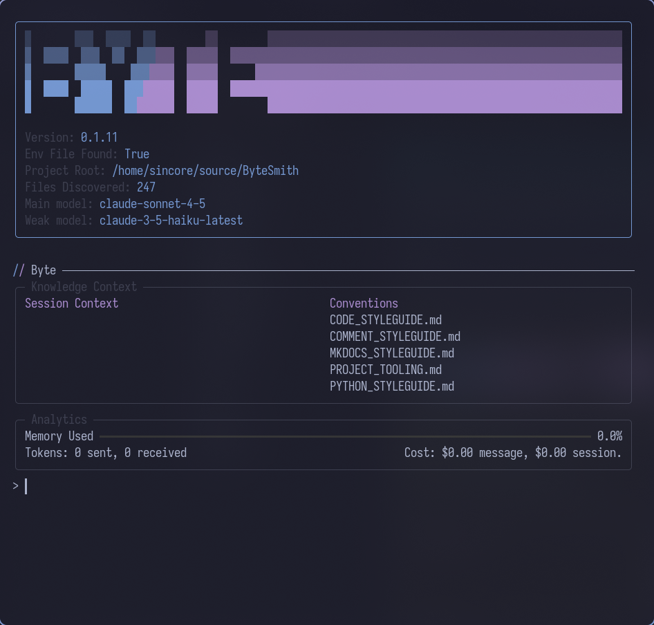

# Installation

Install Byte using your preferred Python package manager. Once installed, you'll have a `byte` command available in your terminal.

---

## Installing Byte

### Using uv

The fastest installation method uses **uv**, a modern Python package installer:

```bash
$ curl -LsSf https://astral.sh/uv/install.sh | sh
$ uv tool install byte-ai-cli
```

### Using pip

Install with pip if you prefer traditional Python tooling:

```bash
$ pip install byte-ai-cli
```

### Using Nix Flakes

For NixOS users or those with Nix flakes enabled, add to your configuration:

```nix
{
  inputs = {
    byte.url = "github:UseTheFork/byte";
  };
}
```

Include in your system packages:

```nix
environment.systemPackages = [
  inputs.byte.packages.${system}.default
];
```

Or run directly without installation:

```bash
$ nix run github:UseTheFork/byte
```

---

## Verify Installation

Confirm the installation succeeded:

!!! tip

    Before running Byte, you must have at least one of these environment variables set:
    `ANTHROPIC_API_KEY`, `GEMINI_API_KEY`, or `OPENAI_API_KEY`.
    See [First Steps](first-steps.md) for configuration details.

```bash
$ byte
```

You should see the following screen after startup.


