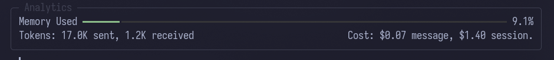

# Workflow Example

This guide demonstrates a complete workflow for adding a feature to Byte using domain-driven development practices. You'll learn how to manage context, reference existing patterns, and iterate on changes with the AI.

---

Byte works best when your project uses Domain-Driven Design (DDD) for both frontend and backend. You can feed an entire domain into the read-only context, making it easy to provide the AI with a template to follow.

In this example, we'll add a progress display to the web command. This workflow uses the CLI, but it can be done just as easily using file watching and AI commands.

## Step 1: Add Files to Editable Context

First, add the files Byte will modify to the editable context. Since the web command resides in the web domain, add the entire domain for editing:

```
/add src/byte/domain/web/**
```


All files in the web domain are now in the editable context.

## Step 2: Add Reference Files

Next, add reference files to the read-only context. This can be an entire domain or just a few files. The key is adding them as read-only so the AI can reference them without making changes.

In this case, the rune spinner is used in only one file, so add the component and its implementation to the read-only context:

```
/read-only src/byte/domain/cli/rich/rune_spinner.py
/read-only src/byte/domain/cli/service/stream_rendering_service.py
```


Now the editable files and read-only reference files are both in context.

## Step 3: Add External Documentation

At this point, you could ask the agent to complete the change. However, since the web scraping implementation uses `pydoll`, it's a good idea to include some of the documentation in the context as well. Use the `/web` command for this:

```
/web https://pydoll.tech/docs/
```


Once scraped, Byte asks if you want to add the content as-is, clean it up using the weak model, or cancel. It's usually good practice to clean up scraped content, but since this feature is small, keep it as-is.


Now that all the pieces are together, ask Byte to make the change.

## Step 4: Request the Change

You can request the change in two different ways:

**Option A: Use `/ask` first**

Use the `/ask` command to see how Byte recommends making this change. Because `ask` doesn't have tools or the ability to change files, it's a good way to discuss the change before Byte implements it. This is possible because memory is shared between main agents.

**Option B: Request directly**

Don't use any command and ask Byte to make the change directly. This is more of a YOLO move, but you can always press `Ctrl+C` to cancel generation mid-prompt.

For this tutorial, use method A:

```
/ask How would you suggest we implement a rich Live using our Rune spinner while we are scraping web content in our ChromiumService
```


The recommendation is close but not perfect. Depending on how close the response is, you may want to follow up with another `/ask`, but in this case, course correct while asking to implement:

```
Instead of calling `self.console = await self.make(ConsoleService)` at boot, call it at the start of `do_scrape`. Also use `with Live(table, refresh_per_second=4) as live:`
```


Byte uses SEARCH/REPLACE blocks so you can see the changes as they happen.

Once the change is applied, if you have lint commands enabled, Byte will run those commands against the changed files:


## Step 5: Commit the Change

That's it! Since the change is complete, run the `/commit` command to lint the files and commit the change:

```
/commit
```


You can now choose to keep asking for changes in the same manner, or use the `/clear` command to clear the chat history, or `/reset` to clear both history and context.

If you continue making changes, remember to keep an eye on how much memory has been used:



---

## Related Concepts

- [File Context](../concepts/file-context.md) - Managing files in the AI's workspace
- [Commit](../concepts/commit.md) - AI-powered commit message generation
- [Web](../concepts/web.md) - Scraping documentation for context
